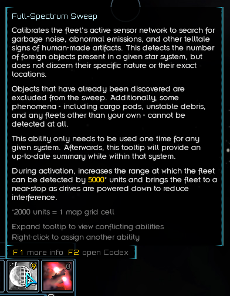
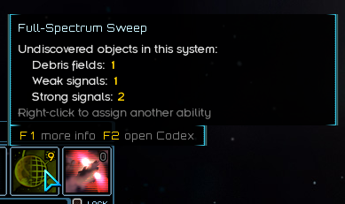
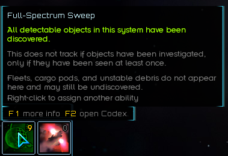

# Full-Spectrum Sweep
This mod adds an activated ability that detects the number of undiscovered objects in a star system, but not their exact locations. Detectable objects include stable debris fields, active stations, and any objects that the neutrino detector can point towards (which includes most things you find during exploration). Results are displayed as a message, with a detailed breakdown available by viewing the ability's tooltip in a scanned system. Any given star system only needs to be scanned once; subsequent visits will use up-to-date results automatically.

This mod is directly inspired by [url=https://fractalsoftworks.com/forum/index.php?topic=20331.0]Objects Analysis[/url], by Harpuea, and functionally does the same core thing. The original mod (and other successors!) don't really function how I want them to, though, and so I built this one from scratch to implement the feature in what I hope is a tidy way that meshes with the existing gameplay loop instead of skipping some parts. It's something to use alongside the neutrino detector, not in place of it!

Can be safely added to, but not removed from, existing saves.

Usage notes:
* Each use requires and consumes 2 volatiles by default.
* Objects are categorized according to the neutrino detector's thresholds: "weak signal" for low sources, "strong signal" for average sources.
* The ability's icon changes color depending on the system's current state. White represents an unscanned system; yellow represents a scanned system with undiscovered objects; green represents a scanned system with all objects discovered.
* Things that aren't detected include:
	* Unstable debris fields/derelict ships, which disappear on their own after a short time
	* Planets and stars
	* Any and all fleets

If [url=https://fractalsoftworks.com/forum/index.php?topic=25658]LunaLib[/url] is installed, several settings are available:
* [b]Volatiles cost:[/b] Defaults to 2. If set to 0, activation is free.
* [b]Enable reminder summaries:[/b] Defaults to True. Whenever entering a system that has been scanned but still has undiscovered objects, shows the remaining quantity as a sidebar message. This is the default behavior, but this setting lets you turn it off if you don't like it.
* [b]Passive mode:[/b] Defaults to False. This treats all systems as though they've already been scanned, removing the need to activate the ability. Results are shown even when entering new areas for the first time. This functions very similarly to Objects Analysis.

