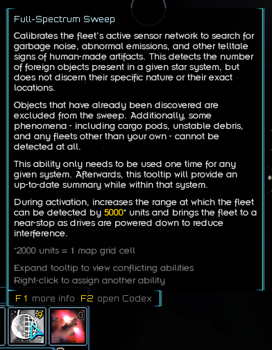
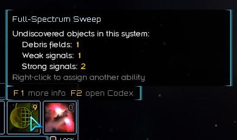
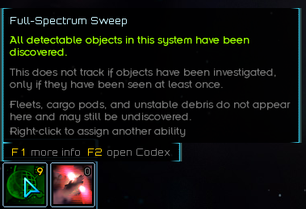

# Full-Spectrum Sweep
This is a mod for Starsector that adds an activated ability that detects the number of undiscovered objects in the current star system, but not their exact locations.

This mod is directly inspired by [Objects Analysis](https://fractalsoftworks.com/forum/index.php?topic=20331.0) by Harpuea, and functionally fills the same role. The original mod still functions on modern versions of the game and there's at least one spiritual successor, but none of the available options really functioned how I wanted them to, and so I built this one from scratch to implement the feature in what I hope is a tidy way that meshes with the existing gameplay loop instead of replacing some of it outright. It's something to use alongside your other tools, not in place of it.

Detectable objects include stable debris fields, active stations, and any objects that the neutrino detector can point towards (which includes most things you find during exploration). Results are displayed as a message, with a detailed breakdown available by viewing the ability's tooltip in a scanned system. Any given star system only needs to be scanned once; subsequent visits will use up-to-date results automatically.

**Can be safely added to, *but not removed from,* existing saves.**

Usage notes:
* Each use requires and consumes 2 volatiles by default.
* Objects are categorized according to the neutrino detector's thresholds: "weak signal" for low sources, "strong signal" for average sources.
* The ability's icon changes color depending on the system's current state. White represents an unscanned system; yellow represents a scanned system with undiscovered objects; green represents a scanned system with all objects discovered.
* Things that aren't detected include:
	* Unstable debris fields/derelict ships, which disappear on their own after a short time
	* Objects you have already discovered
      * Due to the nature of the game engine, this also includes planets, stars, and gates (since you discover them right away upon entering a system for the first time)
	* Any and all fleets. Dormant, active, stationary, moving, it doesn't matter; they won't show up!

[LunaLib](https://fractalsoftworks.com/forum/index.php?topic=25658) is not required to use the mod, but several settings are available if it's installed (mostly in the form of altering the default behavior to suit your tastes):
* **Volatiles cost:** Defaults to 2. If set to 0, activation is free.
* **Enable reminder summaries:** Defaults to True. Whenever entering a system that has been scanned but still has undiscovered objects, shows the remaining quantity as a sidebar message.
* **Show a message once all signatures are discovered:** Defaults to True. Does exactly what it says; once every detected object in a system has been found, displays a message so you know you can move on.
* **Passive mode:** Defaults to False. If turned on, scanning happens automatically upon entering a system; the ability does not need to be manually activated. Volatiles are required as normal according to the configured cost.

## Screenshots

Click to expand (note the changing icon color!)

*In an unscanned system:* 

*In a scanned system, with some undiscovered objects remaining:* 

*In a scanned system, with all objects discovered:* 

## Changelog

### TBD
#### Version 0.1.1
* Passive mode now consumes volatiles upon scanning a new system. The exact amount can be configured (or disabled) as normal.
* Added a new setting that displays a message when all signatures in a system have been discovered. Defaults to false.

### 5 October, 2025
#### Version 0.1
* Initial release. Keeping this here instead of registering on the forum or something because I don't want to worry about all that /o/
